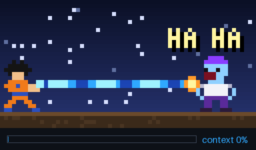
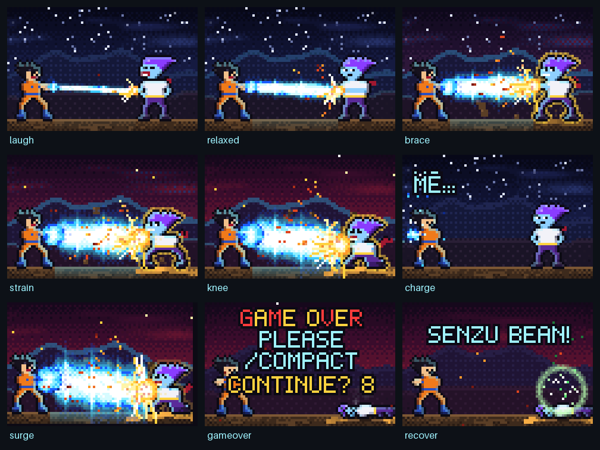
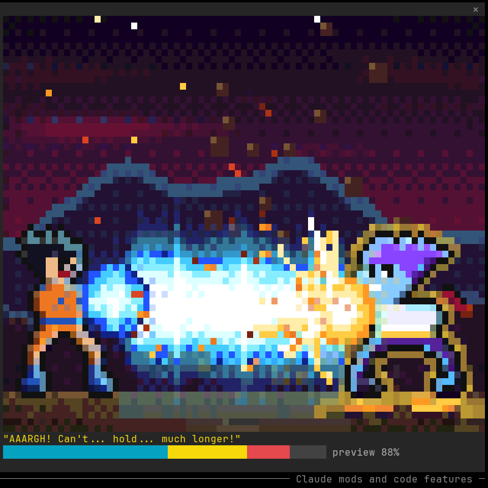
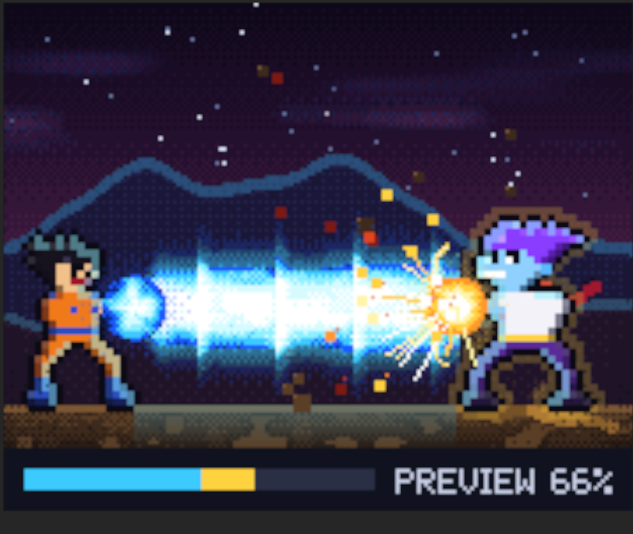
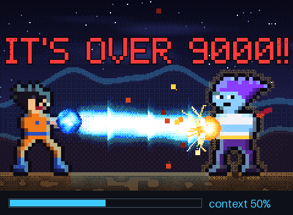

<div align="center">

# ⚡ KAMEHAMEHA ⚡

### Your Claude Code context window, as a pixel-art beam struggle.



**A [Claude Code mod](https://code.claude.com/docs/en/plugins/mods/overview) that turns context usage into a fight you can feel.**
At 5% the hero laughs. At 80% they're screaming. At 95% it's **GAME OVER**, so please `/compact`. Then a senzu bean puts them back on their feet.


</div>

---

## 🎮 Install

Paste this at the prompt of a Claude Code terminal session:

```
/plugin install kamehameha --marketplace Aurumdev952/claude-code-kamehameha
```

Answer `y`, pick a scope, done. Then watch the whole story in about 30 seconds:

```
/kamehameha demo
```

## 🥊 The fight

The fighter charges up (**KA… ME… HA… ME… HAAAA!!**). After that the beam grows with your context window and the hero gets pushed back across the ground.



| Context | The hero | On screen |
|:-:|---|---|
| **0–24%** | 😂 *"HA HA HA! Is that all you've got?"* | Hands on hips, head thrown back laughing, "HA HA!" popping up |
| **25–49%** | 😏 *"Meh. Barely warm."* | Arms crossed, smirking, scarf starting to flap |
| **50–74%** | 😬 *"Ngh… okay, that's getting strong!"* | Arms out, golden ki aura, sweat flying; the sky turns red and the ground cracks |
| **75–89%** | 😫 *"AAARGH! Can't… hold… much longer!"* | Crouched and trembling, a huge beam, debris lifting, embers falling |
| **90–94%** | 😱 *"/compact… NOW…!"* | One knee down, shoved backwards |
| **95%+** | 💀 **GAME OVER** | A slow-motion surge and a white-out, then a shockwave, a smoking crater, and **GAME OVER / PLEASE /COMPACT** typing itself in, with a `CONTINUE? 9…` countdown |
| after `/compact` | 🫘 **SENZU BEAN!** | A bean falls, the hero heals in a green ring, stands up and laughs, and the fighter charges again |

Every new stage lands with hit-stop, a camera kick, a flash and a shout. Past 90k tokens the scouter breaks: **IT'S OVER 9000!!**

## ✨ What makes it tick

- **Up to 60 fps, driven by real time.** A self-pacing frame loop and a simulation that runs on elapsed seconds, so the motion looks the same at any frame rate.
- **Game feel.**
  - The beam size follows a spring, so it surges past a new value and settles.
  - Impacts get hit-stop and decaying screen shake.
  - The game-over surge plays in slow motion.
  - Pose changes dissolve with a dither instead of snapping.
- **A particle system.** Clash sparks with motion streaks, rocks lifting off the ground, ki motes spiralling into the charge, dust, sweat, smoke, embers and healing sparkles.
- **A layered beam.** Scrolling energy texture, rings of light racing toward the hero, a flickering white core, a soft glow, the swirling charge ball, and a clash point where the hero's golden ki shield throws rays.
- **Real pixel art.**
  - Hand-drawn characters, with outlines, rim light from the beam and shadows added automatically.
  - Swappable facial expressions.
  - A scarf blown back by the beam.
  - One curated palette with ordered dithering.
- **A world.** A sky going from calm night to blood-red storm, drifting clouds, two layers of mountains, ground that cracks open, and a crater.
- **Two renderers.**

| Terminal | Renderer | What you get |
|---|---|---|
| **kitty, Ghostty** | `pixels` (auto) | A real image at 2–3× resolution (smooth glow, fine sparks, fine ridgelines) with the gauge drawn into the picture |
| **everything else** (WezTerm, iTerm2, Alacritty, Windows Terminal…) | `cells` (auto) | Two pixels per character cell with the `▀` block in true color |

<table>
<tr>
<td align="center"><br><sub>Live in WezTerm: <code>cells</code></sub></td>
<td align="center"><br><sub>Live in kitty: <code>pixels</code></sub></td>
</tr>
</table>

<div align="center"><br><sub>The <code>pixels</code> renderer, recorded with the mod's own engine</sub></div>

## ⌨️ Commands

| Command | Does |
|---|---|
| `/kamehameha` | Open the showdown pane |
| `/kamehameha demo` | Play the whole story: charge, fight, GAME OVER, senzu bean (about 30 s) |
| `/kamehameha 80` | Preview any percentage |
| `/kamehameha live` | Go back to your real context usage |
| `/kamehameha pixels` / `cells` | Switch renderer for this session |
| `/kamehameha fps 30` | Change the frame rate for this session |
| `/kamehameha stats` | Live frame rate, draw time per frame, renderer and size |

You also get a three-color gauge (`████████░░ 71%  142k / 200k`) with a caption under the art (in `pixels` mode the gauge is part of the picture), a status line warning from 75%, and toasts when the hero falls, gets back up, or passes 9000.

## ⚙️ Settings

Set these in `/plugin` (or under `pluginConfigs.kamehameha` in settings):

| Setting | Default | |
|---|---|---|
| `renderer` | `auto` | `auto`, `cells` or `pixels` |
| `fps` | `60` | 10 to 60. Lower it to save CPU: 30 looks smooth too. The `pixels` renderer is capped at 30 (see below). |
| `sound` | `false` | Charge, beam, impact, explosion, heal and scouter sounds. **macOS only:** Claude Code has no audio player on Linux or Windows. |

## 📊 Performance

Measured live in Claude Code 2.1.293 with a 79×31-cell docked pane, using `/kamehameha stats`:

| Terminal | Renderer | Calm (30%) | Peak (85–93%) | Draw time |
|---|---|---|---|---|
| WezTerm | cells | **60 fps** | 50–57 fps | 1.3–3 ms |
| kitty | pixels | **30 fps** | **30 fps** | 6–13 ms |

- **Why `cells` dips at peak:** the limit there is how many terminal cells change per frame, not the drawing itself.
- **Why `pixels` is capped at 30:** each frame sends a whole new image, and above about 30 a second kitty shows the gap between two images as a blank flash. Screen samples measured 13% blank at 60 fps, 1–2% at 40, and **0%** at 30 or below. For the same reason, the pixel picture draws its own gauge, because redrawing the pane would also flash. If drawing runs long, the picture drops from 3× to 2× resolution automatically.
- **CPU:** an animated pane costs real CPU, so set `fps` to 30 if your machine is busy. With the pane closed, the fight keeps running ten times a second, with no drawing.

## 🔬 How it works

```
session.measure ─► context % ─► director.update(dt)  springs, stages, timelines, particles, events
                                        │
               self-pacing frame loop ($.clock.after)
                                        ▼
       render.paint()   sky · mountains · ground (cached at 4 Hz)
                        fighter · scarf · aura · hero (dither blend)
                        beam · charge · clash · particles · callouts · titles
                        vignette · shake · flash
                                        ▼
         cells:  '▀' fg/bg pairs ─► Raster      pixels:  RGBA ─► Image (kitty graphics)
                                        ▼
                          $.ui.blit() into the pane, at up to 60 fps
```

- **Zero tokens.** It reads the status line's context figures and never calls the model.
- **Small footprint.** No network, no processes and no file writes. Mods run with your permissions, so check that claim: `claude plugin validate` lists every call:

```
❯ calls: $.audio.play, $.clock.after, $.clock.now, $.command.register, $.env.get,
         $.session.usage, $.ui.blit, $.ui.invalidate, $.ui.open, $.ui.resolve,
         $.ui.status, $.ui.toast
❯ env reads: KITTY_WINDOW_ID, TERM_PROGRAM
```

## 🛠️ Hack on it

```bash
git clone https://github.com/Aurumdev952/claude-code-kamehameha
claude --plugin-dir ./claude-code-kamehameha        # run it from source
claude plugin test ./claude-code-kamehameha         # 17 tests
bun tools/record.ts out --script demo && python3 tools/gif.py out gif demo.gif 4   # re-record the GIF
python3 tools/sounds.py                             # re-synthesize the sounds
```

| Path | What's inside |
|---|---|
| [`hooks/register.tsx`](hooks/register.tsx) | The mod: context tracking, the frame loop, renderer choice, pane, command, toasts, sounds |
| [`hooks/engine/director.ts`](hooks/engine/director.ts) | The fight as a simulation: spring, stages, hit-stop, the charge, game-over and recovery timelines, callouts |
| [`hooks/engine/render.ts`](hooks/engine/render.ts) | Layout, the layers in order, camera, titles, both encoders |
| [`hooks/engine/sprites.ts`](hooks/engine/sprites.ts) | Character maps, faces, auto outline, rim light and shadow, pose dissolve, aura |
| [`hooks/engine/beam.ts`](hooks/engine/beam.ts) · [`scenery.ts`](hooks/engine/scenery.ts) · [`particles.ts`](hooks/engine/particles.ts) | The beam, the world, the particles |
| [`hooks/engine/palette.ts`](hooks/engine/palette.ts) · [`font.ts`](hooks/engine/font.ts) · [`rng.ts`](hooks/engine/rng.ts) · [`canvas.ts`](hooks/engine/canvas.ts) | Palette and dithering, the 5×7 pixel font, seeded noise, the pixel buffer |
| [`hooks/*.test.ts(x)`](hooks) | Stages, spring overshoot, frame-rate independence, hit-stop, charge, GAME OVER, senzu recovery, OVER 9000, beam growth, encoders, a 60 fps budget, the 1024-color-pair limit, the pane on terminal and desktop, a full session with sound |
| [`tools/`](tools) | The headless recorder, GIF and contact-sheet maker, and sound synthesizer |

The engine has no Claude Code dependency: it's plain TypeScript, so the tests and the recorder drive the same code the pane runs.

## ⚖️ Disclaimer

An unofficial fan homage. It isn't affiliated with or endorsed by the owners of *Dragon Ball*. All sprites, sounds and the font are original, made for this mod.

## 📄 License

[MIT](LICENSE)
